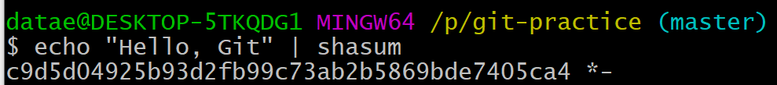

​	

## 'Complete Git Guide(Udemy Lecture)' Study 2 (2020.06.30)

> 윈도우를 쑤고 있었기에, 지난주까지 그냥 Window Prompt로 명령어를 입력했다...
>
> Git bash가 있는지 모른채 말이다...
>
> 천재 개발자 지환이가 답답해하며 알려준 덕분에 Git bash라는, Window에서도 리눅스 환경의 커맨드 라인을 입력할 수 있는 터미널 어플리케이션을 알게되었다 (이미 내 컴에 설치되어있었지만 무지하여 아무것도 몰랐다...).
>
> 이제부터 Git Bash로 이 강의를 더욱 알차게 따라갈 수 있을 것 같다.


### * What is Git Bash? - 그럼 Git Bash가 무엇인지부터 알고가자.

```
Git Bash is an application for Microsoft Windows environments which provides an emulation layer for a Git command line experience. Bash is an acronym for Bourne Again Shell. A shell is a terminal application used to interface with an operating system through written commands. Bash is a popular default shell on Linux and macOS. Git Bash is a package that installs Bash, some common bash utilities, and Git on a Windows operating system.

(https://www.atlassian.com/git/tutorials/git-bash)
```

쉽게 말해 Bash는 Shell 어플리케이션으로, 리눅스 환경에 default로 내장되어있는 프로그램이다.

Git Bash는 Bash와 Git, 기타 등등이 한 데 묶인 package로서 윈도우 환경에서 bash를 활용, git을 컨트롤할 수 있게 해준다.


### 1.  Git Object

- In .git directory, we have seen a folder named 'objects'. What is this folder in charge of and what is a git object?
- There are four types of git object in which git stores all the necessary data. Each type is called **Blob, Tree, Commit and Annotated Tag**.
  - **Blob** : Any type of file is stored as Blob such as video, image and text, etc.
    - It represents a single file.  
  - **Tree** :  Tree represents folders or directories.
  - **Commit** : Stores different type of versions.
  - **Annotated Tag** : text pointer which points commit.

- Here I created an object by using 'git hash-object' command (--stdin is to create it based on standard configuration).

- Underneath the command line, we can see a very strange code. This code is actually a hash code, which points out the location and the object in the directory(in the hidden .git foler, not in the main folder) like below.

- A new file has been created in the directory named 'b7' and the file name starts with 'aec...' that is obviouly the same letters as the hash code.
- The hash code is created by input and in this example, it was the string that I had written, 'Hello, Git'. Then how does Git convert a string into a long, strange hash code?


### 2. Git Hash Code - SHA1

-  Features of Hash Function
  - Hash function is '**one-way**' function : Hash code is created from input value, but it is impossible to create value from the code.
  - Same input produces **the same hash code**.
  - Hash code has **fixed length**. No matter what kind of input, the length will be the same.
- There are various types of hash function such as MD5(produces 128bit hash code), SHA1(160bit), SHA256(256bit)...
- **Git uses SHA1 hash function** which uses **160bits** / **40 hexadecimal(1,2,3,...9,A,B,C,D,E,F) characters**.

- if you add '| shasum' right next to echo command line, you will see the converted hash code down below like this : 

  

- These characters are exactlly 40 hexadecimals encoded from the string "Hello , Git".