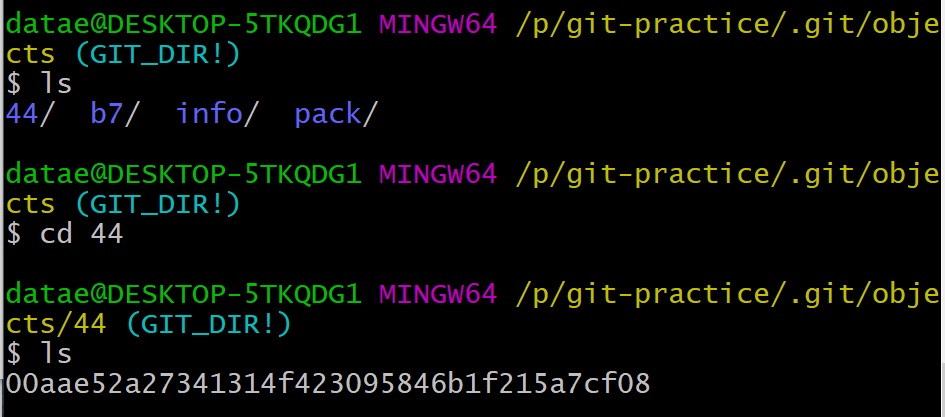

​	

## 'Complete Git Guide(Udemy Lecture)' Study 3 (2020.07.03)

### 1.  Hash Collision of SHA1

- We have learned that Git uses hashing technique to give a unique key to file. Then these following questions might come up : **How many files can git store with different hashing code?**
- Since Git hash code is based on SHA1(as we discussed in the last lecture), hash code consists of 160 bits which is exactly 2^160. It is clearly **a huge number.**
- So **Git can store 2^160 files in a repository with different hash code**
- Then what is the probability of hash collision ? In other words, what if two files have the same hash code ?
- It's basic math. The probability of two files having the same hash code is : 1/2^160 * 1/2^160...which is too small number to care about.
- Therefore, you do not have to worry about hash collision of Git.

#### 2. Git low-level commands

##### 1) git cat-file options

- git cat-file -p <hash> : Contents of the object

- git cat-file -s <hash> : Size of the object

- git cat-file -t <hash> Type of the object (Blob, Tree, Commit, Annotated Tag)

  - Each usage example is like below : 

    

  

- Those commends indicate that  the file content of hash code  **b7aec520dec0a7516c18eb4c68b64ae1eb9b5a5e** is "Hello, Git", the type is blob, and the byte size is 11.

**2) git hash-object**

- You can use [echo "Content" | git hash-oectject -- stdin - w ] command to create an hash-object.

- We also can use [git hash-object <filename> -w ] command to do the same thing.

- If I create a text file with content of 'Hello, Git' text, store it in a directory, and punch the command line with its filename, a git object will be created in the git repository.

  

  < Create an hash-object based on a text file named 'new-file.txt' >

  

  < A directory named '44' has been created storing an object '00aae....' which I had commanded to create > 

  

  < Corresponding outputs of each cat-file command option >

- We have to make sure that **git blobs do not have filenames.** The hash code is created based on the content of a file, not on the name of it. 

- So the name of a git blob object actually can be decoded to the content, not to the file name - and that's why this command [echo "Content" | git hash-oectject -- stdin - w ] do not require file name in itself.

- And where the size and the type of each object are stored in Git ? : Each blob object stores them inside of itself.

**3) Structure of Git Object**

- A git object consists of three elements : **Content, object type, object length(size)** 

- It is structured as : {Object Type}{Object Length}{Delimiter(Null)}{Content}

- So if I try to make a hash code by using Shasum command like below : 

  

- The same hash code we created in the last lecture with the content "Hello, Git" pops up.

- Each line I wrote down between quote marks indicates the object type(blob), object length(11), delimiter(\0) and content(Hello, Git). Shasum shows us the same hash code, as a result.

- Therefore, if you want to make the same hash code as we already created above with a text file, you just type object type, size and content like below : 

  

- Then we can see the same hash code has shown. This is the structure of git object.

