​	

## 'Complete Git Guide(Udemy Lecture)' Study 4 (2020.07.18 - 21)

### 1.  Tree object

- **Blobs do not contain the file name of the source.** That's where the tree object is kicked in. 

- Blob contains content, file type, size and delimiter. Tree represents directory in git structure.

- Then what is the structure of tree ? It's the same one as blob : 

  - [Type(Tree)] [size] [delimiter] [content]

- What does tree content have ? Tree content consists of four fields : 

  [Permission] / [type] / [sha1 hash] / [**name**]

  **So tree is the one that stores file name, not blob.**

- Each tree is linked to other trees or blobs, so let's create a new tree object by git bash using nano command.

  *** git mktree --help** command shows you (or pops up a web page) a detailed guideline about the command.

- Firstly, let's create a text file on my directory as below : 

  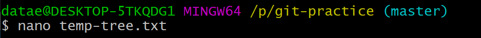

- Then we can see the screen below : 

  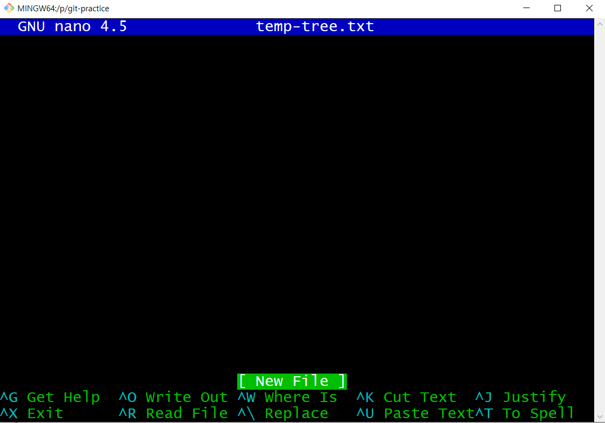

- **Nano command** is meant to edit a text file, so we just put the content of the tree we are about to create. 

- As mentioned above, a tree object consists of four parts : [Permission] / [type] / [sha1 hash] / [**name**], so now I am making this tree object linked to the two blobs we have already built.

  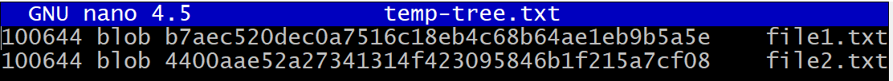

- First write the permission. There are several permissions in Git and **100644** represents a regular non-executable file to which blobs belong. 

- Second punch the type, blob, and put the same hash codes of the blobs.

- Finally using tab, not a space, and insert file names of the blobs. Remember blobs do not have names but trees do, so we indicate the names here in the text.

- Each line points to a blob object by those information.

- When the job is done, get out of the nano command screen and type cat command on the terminal with git mktree command like below : 

  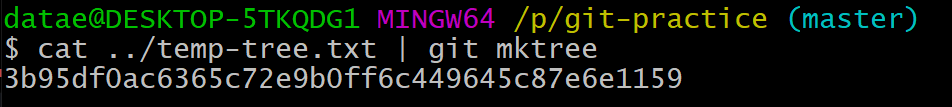

- Then we can see a new git object has been created with a new hash code.

### 2. Structure of trees and blobs

- Let's check out the tree object we just built by using cat-file command.

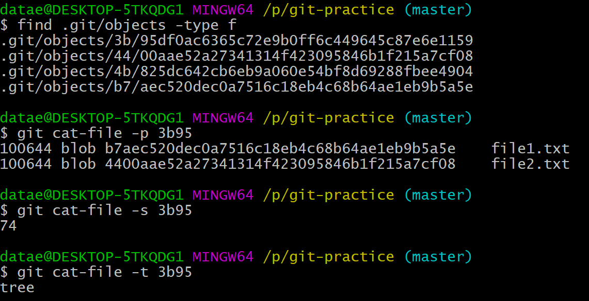

- Showing that the objects whose name starts with '3b95' has a size of 74 and its type is tree.

- So now we can figure out how trees and blobs are structured in Git system.

  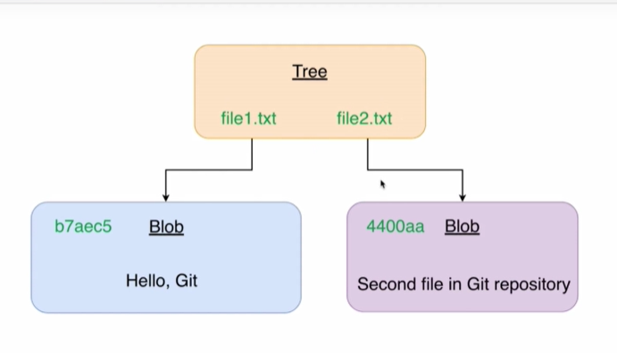

### 3. Working directory, Staging area and Git repository

- Before we put any object in the repository, there are extra stages in the Git system, Working directory and Staging area, which is also called 'index'.

- Staging area is where objects are prepared to be inserted to repository and also to be taken out from the repository.

- Putting or taking out a file through Staging area is **mandatory**.

- If we want to check what files are now on the staging area, we can type 'git ls-files' command on terminal to see it.

  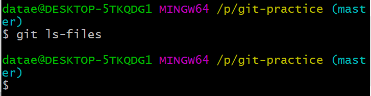

- Nothing has shown up, which means there is no file now on the staging area.

- At the moment, we have one tree and two blobs which are linked to the tree and they are all in our Git repository (.git). So let's take them out of it and put them onto the staging area.

- And also note that now **our tree represents our root directory** (As long as it is not connected to other tree, it must be our root one).

- To retrieve objects from Git repository, **git read-tree command** is required with the argument of hash code.

- Hash code needs to find which object we would like to pull out.

  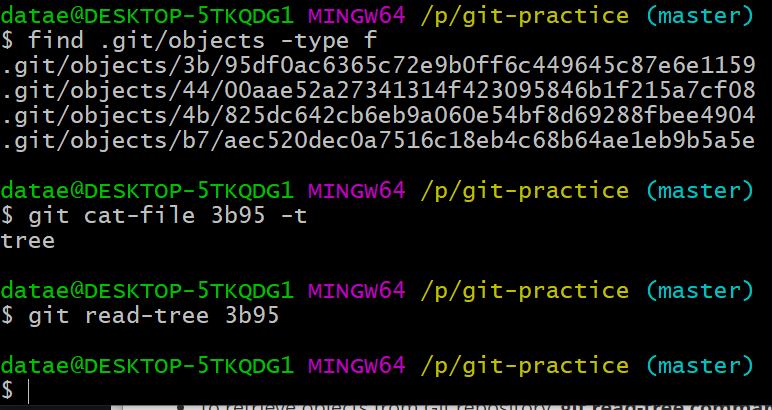

- So in our repository, there we can see four files with distinct hash code.

- First find the tree object by cat-file command with -t option.

- And then type git read-tree command with the hash code at the end. Nothing appears, but we can check what has happened on the staging area by using the same command **git ls-files** with option **-s**.

  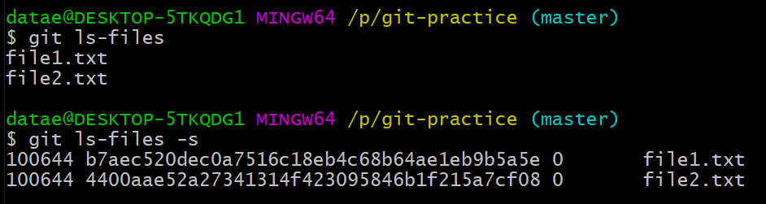

- Two zero right next to the hash code indicate that those files are on the same as the ones in Git repository.

- Let's push them onto the working directory. Notice that in [git-practice] folder, we do not have any files except an hidden folder .git.

- **git checkout-index -a** command is to take files on the staging area out and put them into the working directory. -a option stands for **all**, so it pulls all the files on the staging area.

  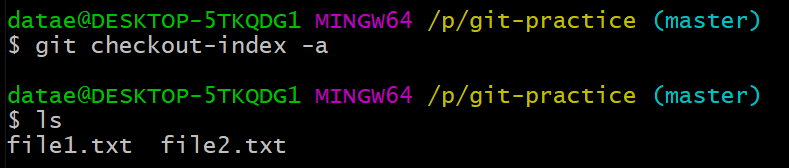

- Finally, we can see those files in the working directory!

  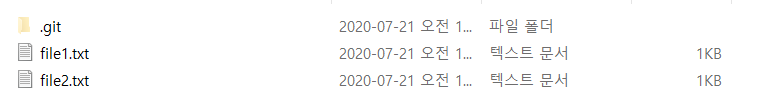

### 4. How many folders for objects Git create in ".git/objects" ? 

- a folder name consists of two hexadecimal numbers like 'b7' or '44'. Since there are only two spots, it should be 16 *16 cases, which is 256.
- If two objects coincidently have the same first two letters of their hash code, they will be stored in the same folder (but again, it does not mean that they are related).

>Tip
>
>[ git status ] command will show us the current status of it.

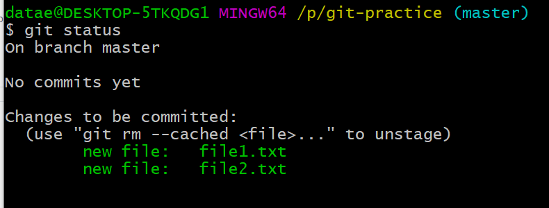